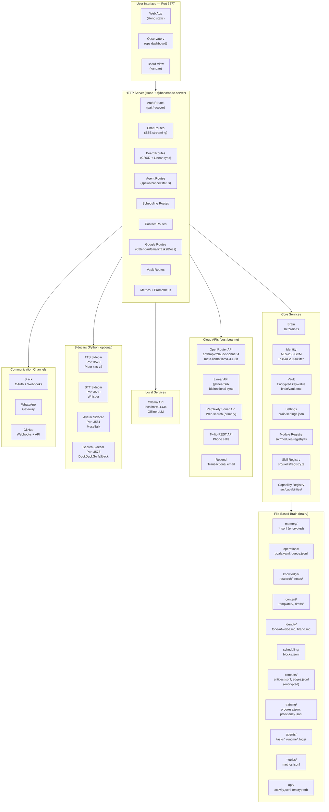
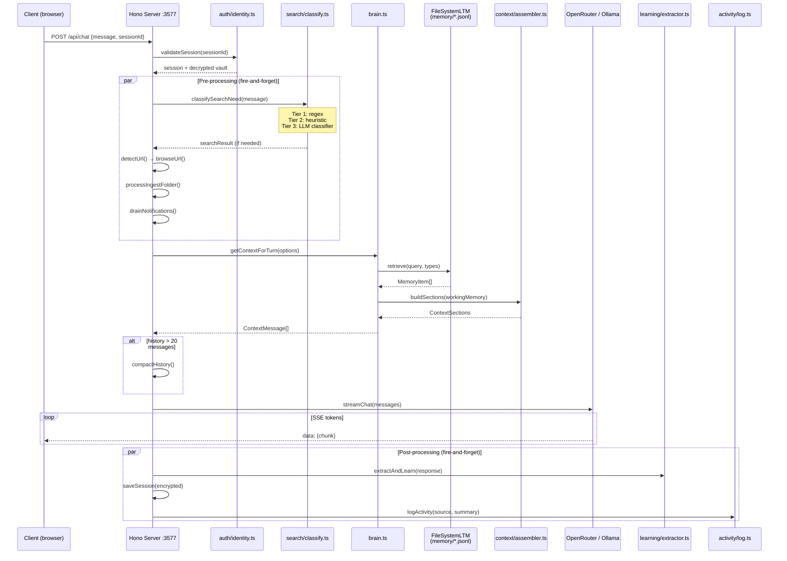
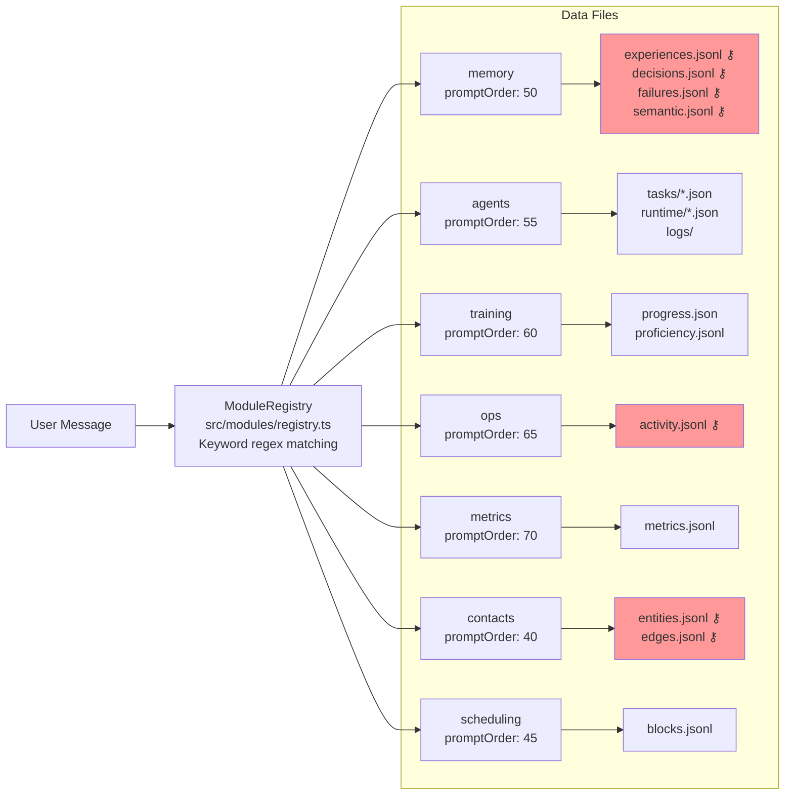
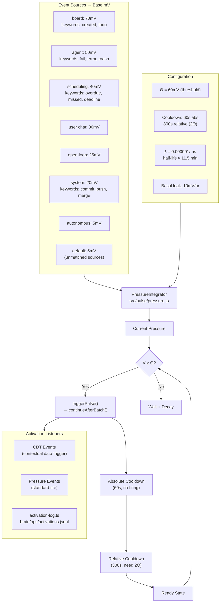
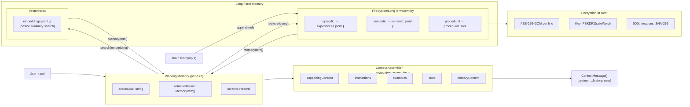
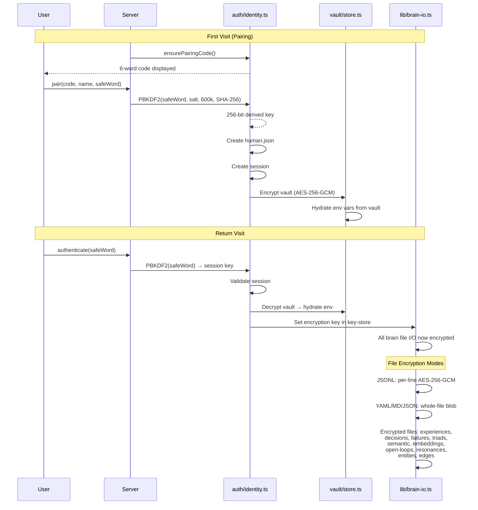
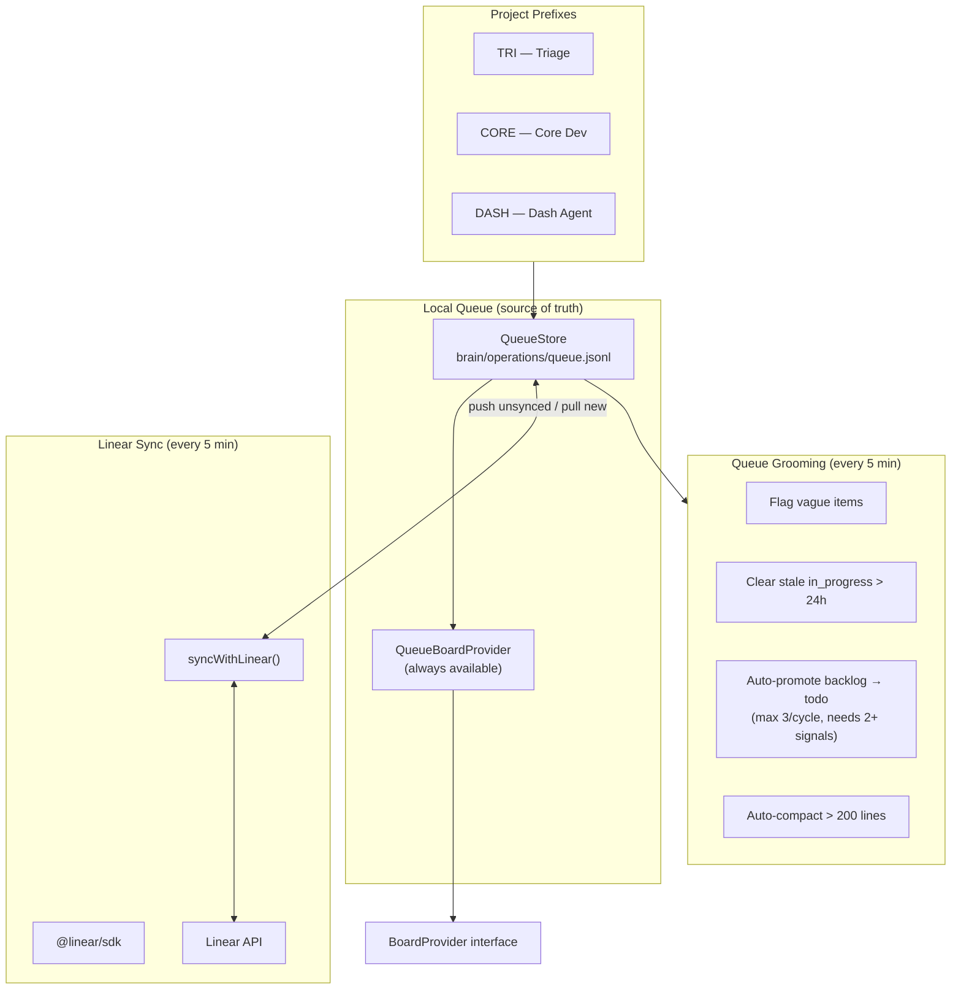
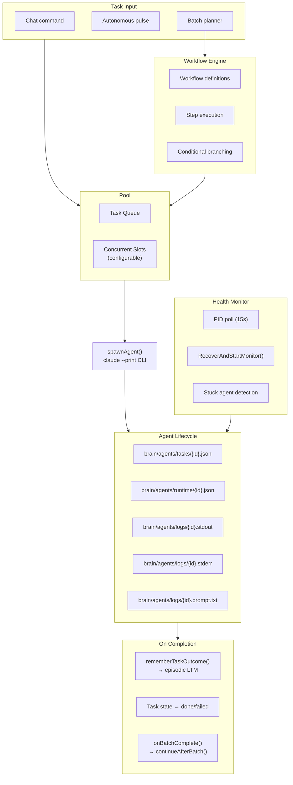
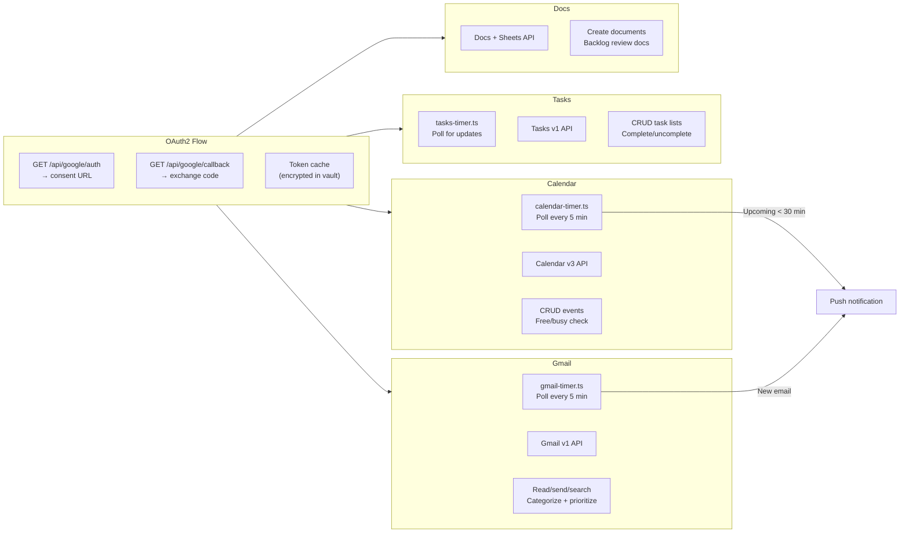

# Architecture Diagrams (Private)

Full-detail diagrams including integrations, service names, ports, encryption,
and implementation specifics. For internal planning, partnership discussions,
and cost analysis.

---

## 1. System Overview — Full Integration Map

---

## 2. Data Flow — Chat Request Lifecycle (Full Detail)

---

## 3. Brain Modules — Full Module Map

---

## 4. Activation System — Full Pressure Configuration

---

## 5. Memory Architecture — Full Implementation

---

## 6. Authentication & Encryption Flow

---

## 7. Board & Queue — Bidirectional Linear Sync

---

## 8. Agent Runtime — Full Architecture

---

## 9. Google Workspace Integration

---

## 10. Timer & Background Process Map

```mermaid
flowchart TD
    subgraph Timers["Background Timers"]
        T1["Calendar Timer<br/>5 min — upcoming events"]
        T2["Gmail Timer<br/>5 min — new messages"]
        T3["Tasks Timer<br/>5 min — task updates"]
        T4["Goal Timer<br/>30 min — goal check"]
        T5["Grooming Timer<br/>5 min — queue maintenance"]
        T6["Scheduling Timer<br/>5 min — block transitions"]
        T7["Autonomous Timer<br/>60 min — coma failsafe"]
        T8["Backlog Review<br/>Weekly (Friday)"]
        T9["Morning Briefing<br/>Daily (configurable hour)"]
        T10["Insights Timer<br/>Periodic — trace analysis"]
        T11["Open Loop Scanner<br/>Ambient resonance"]
        T12["Metrics Collector<br/>30s — system metrics"]
    end

    subgraph Effects["Side Effects"]
        Notify["Push Notification"]
        Activity["Log Activity"]
        AddPressure["Add Pressure<br/>(pressure integrator)"]
        StateChange["State Transitions<br/>(blocks, tasks)"]
        Compact["JSONL Compaction"]
    end

    T1 --> Notify
    T2 --> Notify
    T3 --> Activity
    T4 --> Notify
    T4 --> Activity
    T5 --> StateChange
    T5 --> Compact
    T6 --> Notify
    T6 --> AddPressure
    T6 --> StateChange
    T7 --> AddPressure
    T8 --> Activity
    T9 --> Notify
    T10 --> Activity
    T11 --> Activity
    T11 --> AddPressure
    T12 --> Activity

    subgraph Shutdown["Graceful Shutdown"]
        SIGINT["SIGINT / SIGTERM"]
        SIGINT --> StopAll["Stop all timers<br/>Drain agent pool<br/>Stop sidecars<br/>Close browser<br/>Shutdown LLM cache"]
    end
```

