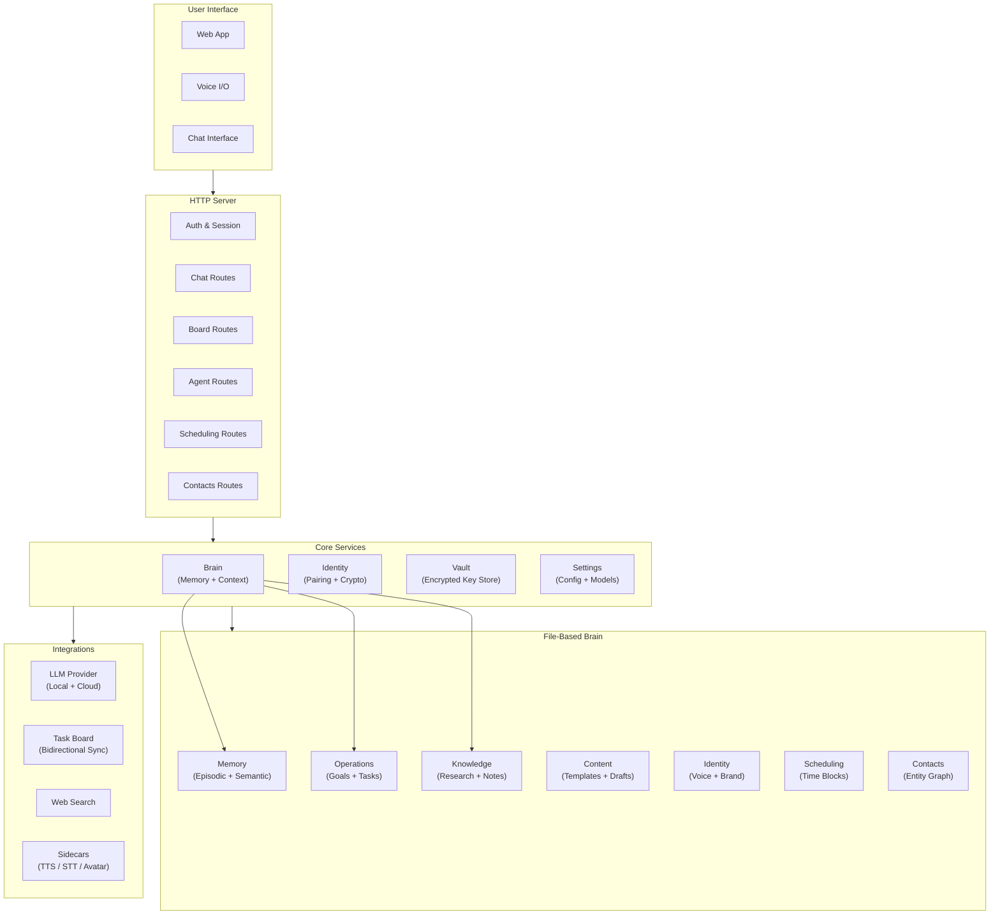
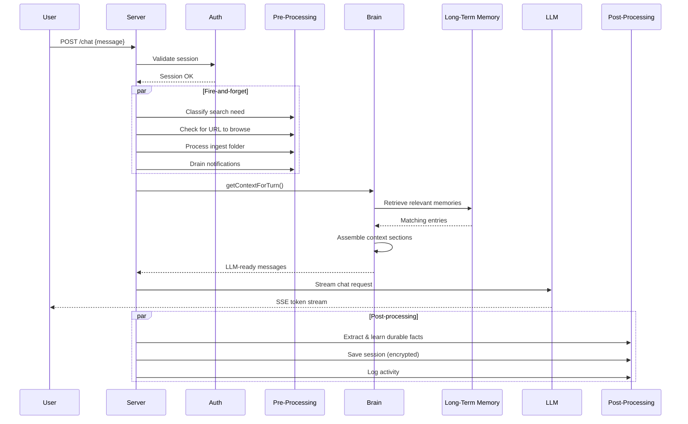
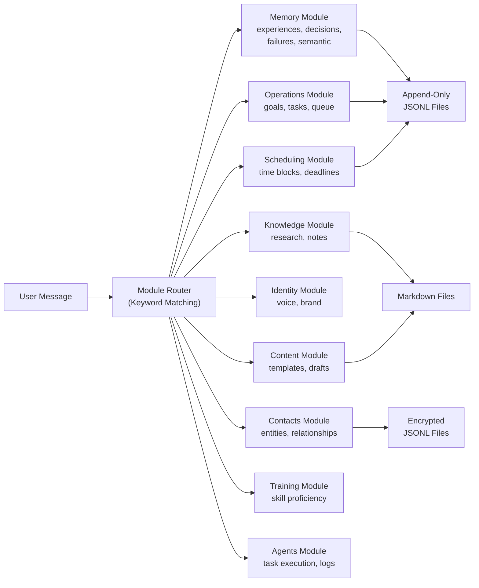
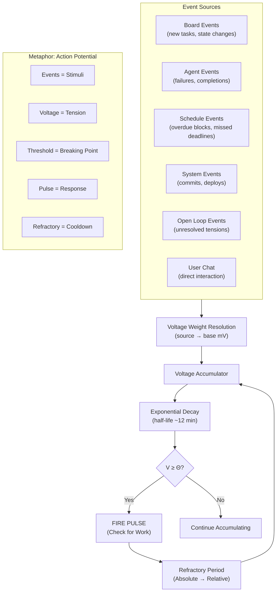
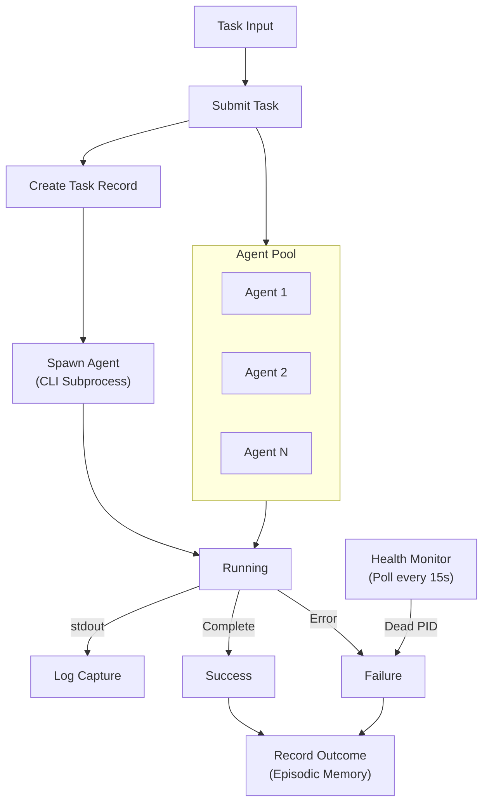
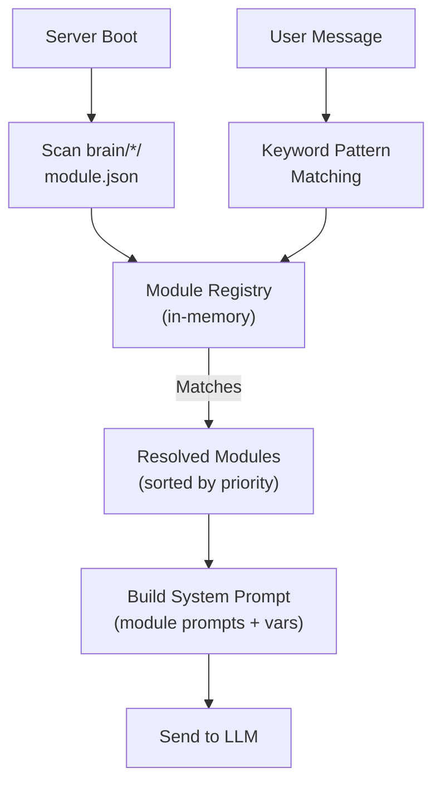

# Architecture Diagrams (Public)

De-identified diagrams suitable for blog posts, the whitepaper, and herrmangroup.com.
Shows the *pattern* without revealing proprietary implementation details.

---

## 1. System Overview

---

## 2. Data Flow — Chat Request Lifecycle

---

## 3. Brain Modules — Structure & Routing

---

## 4. Pulse System — Tension / Voltage / Activation

---

## 5. Memory Architecture

```mermaid
flowchart LR
    subgraph WorkingMem["Working Memory<br/>(Per-Turn Scratchpad)"]
        Goal["Active Goal"]
        Retrieved["Retrieved Items"]
        Scratch["Scratch Space"]
    end

    subgraph LTM["Long-Term Memory<br/>(Persistent JSONL)"]
        Episodic["Episodic<br/>Experiences, Decisions,<br/>Failures"]
        Semantic["Semantic<br/>Facts, Preferences,<br/>Knowledge"]
        Procedural["Procedural<br/>How-To, Workflows"]
    end

    subgraph ContextAssembly["Context Assembly"]
        Support["Supporting Content<br/>(retrieved memories)"]
        Instructions["Instructions<br/>(system prompt)"]
        Examples["Examples<br/>(few-shot)"]
        Cues["Cues<br/>(output hints)"]
        Primary["Primary Content<br/>(user input)"]
    end

    Input["User Input"] --> WorkingMem
    WorkingMem -->|Retrieve| LTM
    LTM -->|Matches| WorkingMem
    WorkingMem --> ContextAssembly
    ContextAssembly --> Output["LLM Message Array<br/>[system, ...history, user]"]

    LTM -.->|Learn| NewEntry["New Entry<br/>(append-only)"]
```

---

## 6. Agent Lifecycle

---

## 7. Module Discovery

